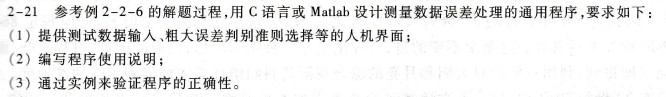
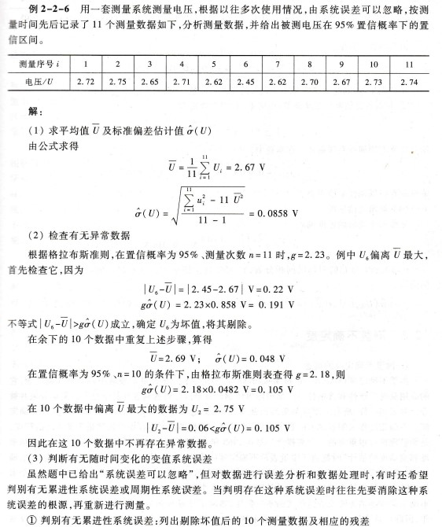
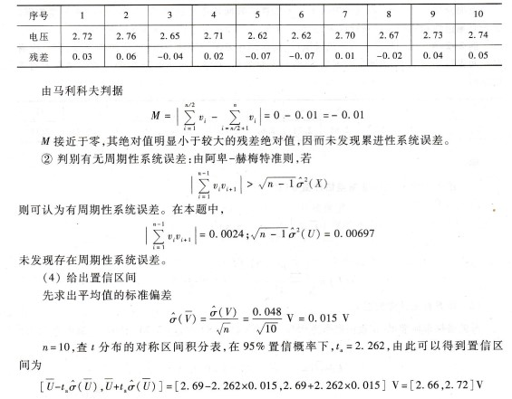
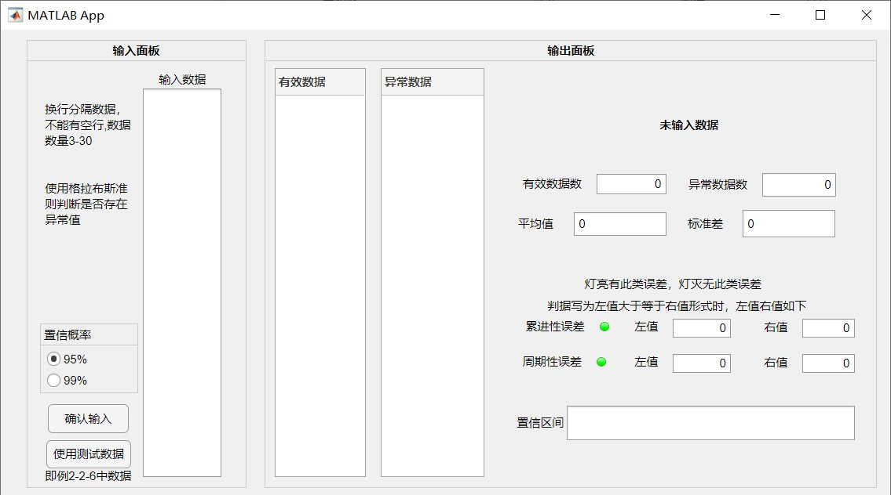

# 目标

编写程序满足《电子测量》第2-21题要求，分别使用matlab和QT实现，提供图形化界面。


下载链接见底部。



例2-2-6如下




# matlab程序

matlab提供了求解平均值、方差、标准差等的函数，且默认按n-1计算，即估计值，直接调用相应函数即可实现。由于使用格拉布斯准则查表判断有无异常数据，且只提供了3到30的值，故只能输入3到30个数据，可自行拓展。

## 命令行版代码

在图形化前先编写了命令行方式输出的程序，Data为输入数据。

```matlab
clear;clc;
Data=[2.72,2.75,2.65,2.71,2.62,2.45,2.62,2.70,2.67,2.73,2.74];
standard=0.95;
if length(Data)>30 || length(Data)<3
    disp("需输入3到30个数据");
end
%% 去除异常数据
keepon=1;
while keepon
    n=length(Data); 
    meanVal=mean(Data);
    stdVal=std(Data);
    [keepon,Data]=Gcheck(Data,standard,meanVal,stdVal,n);
end
%% 累进性误差
if mod(n,2)
    if sum(Data(1:n-1/2)) - sum(Data((n+1)/2:n)) > max(abs(Data-meanVal))
        disp("存在累进性误差");
    else
        disp("无累进性误差");
    end
else
    if sum(Data(1:n/2)) - sum(Data(n/2+1:n)) > max(abs(Data-meanVal))
        disp("存在累进性误差");
    else
        disp("无累进性误差");
    end
end
Vari = Data - meanVal;
%% 周期性误差
for i=1:n-1
    add = abs(Vari(i)*Vari(i+1));
end
if add > var(Data)*sqrt(n-1)
    disp("存在周期性误差");
else
    disp("无周期性误差");
end
%% 
stdAverage=stdVal/sqrt(n);
t=icdf("T",(1-standard)/2+standard,n-1);
range=[meanVal-t*stdAverage meanVal+t*stdAverage];
out=sprintf('%0.1f%%置信区间[%f,%f]',standard*100,range(1),range(2));
disp(out);


%% 格拉布斯准则
function [ret,retData]=Gcheck(x,standard,meanVal,stdVal,n) 
reg=abs((x-meanVal)./stdVal); 
[reg_max,i]=max(reg); 
%% 确定g值
T=[1.153 1.463 1.672 1.822 1.938 2.032 2.11 2.176 2.234 2.285 2.331 2.371 2.409 2.443 2.475 2.501 2.532 2.557 2.58 2.603 2.624 2.644 2.663 2.681 2.698 2.714 2.73 2.745;...      
1.155 1.492 1.749 1.944 2.097 2.22 2.323 2.41 2.485 2.55 2.607 2.659 2.705 2.747 2.785 2.821 2.954 2.884 2.912 2.939 2.963 2.987 3.009 3.029 3.049 3.068 3.085  3.103]; 
switch standard
    case 0.95
        g=T(1,n-2); 
    case 0.99          
        g=T(2,n-2); 
    otherwise
        disp('输入了错误的置信概率'); 
end
%% 剔除
if reg_max>g     
    ret=1; 
    out=['剔除异常数据：',num2str(x(i))];
    disp(out);
    x(i)=[];
else
    ret=0;
    disp('无异常数据'); 
end
retData=x;
end
```

## GUI界面

根据题目需要，设计如下GUI界面



## GUI版代码

调整代码输入输出以适应图形化界面，导出代码较长，置于本文末尾。

# QT

相比于matlab，在QT中没有那么丰富可直接使用的函数，更多需要自行编写，为便于处理，定义Data类用于存放数据和处理数据。格拉布斯准则表和置信区间表范围都为3到100，故可输入3到100个数。

main.cpp未进行修改。

## Data类头文件

Data类头文件如下，使用QList容器存放数据，变量和函数含义见注释。由于平均值、方差等数据存在相互关联，需要以特定顺序调用计算函数，故定义为私有函数，使用`updata()`调用。Data.cpp内容见末尾。

```cpp
#ifndef DATA_H
#define DATA_H

#include "qtextbrowser.h"
#include <QWidget>

class Data
{
public:
    QList<double> value;//数据值
    QList<double> deleted;//删除的异常数据
    double mean;//平均值
    double var;//方差
    double confidence_l;//置信区间左值
    double confidence_r;//置信区间右值

    void init(const QList<double>);//输入数据赋值给value
    void printData(QTextBrowser *);//输出到指定文本显示框
    void update();//更新基础信息（调用四个无返回值私有函数）
    void check(int);//检查粗大误差（删除值移至deleted）
    bool accErrJudge();//判断是否为累进性误差（调用regAbsMaxCal）
    bool perErrJudge();//判断是否为周期性误差
    void confidence(int);//计算置信区间
private:
    QList<double> reg;//残差
    double regAbsMax;//残差绝对值最大值

    void meanCal();//计算平均值
    void varCal();//计算方差
    void stdCal();//计算标准差
    void regCal();//计算残差
    int regAbsMaxCal();//计算残差绝对值最大值
};

#endif // DATA_H
```

## widge头文件

主要处理过程在widge.cpp实现，`readin()`和`test()`两个槽函数分别链接到”输入数据“和”输入数据“按钮。widge.cpp内容见末尾。

```cpp
#ifndef WIDGET_H
#define WIDGET_H

#include <QWidget>
#include "Data.h"
#include "qtextbrowser.h"

QT_BEGIN_NAMESPACE
namespace Ui { class Widget; }
QT_END_NAMESPACE


class Widget : public QWidget
{
    Q_OBJECT

public:
    Widget(QWidget *parent = nullptr);
    ~Widget();
    Data data;//数据类
private slots:
    void readin();//读取数据
    void test();//输入预定义测试数据
private:
    Ui::Widget *ui;
    void DataPrint(QTextBrowser *,QList<double> list);//文本形式输出数据
    void ListPrint(QTextBrowser *,QList<double> list);//列表形式输出数据
    void uiDisplay();//界面显示
    int buttonCheck();//检查置信概率按钮选择
    void errJudge();//判断误差类型
    void process();//处理数据
};
#endif // WIDGET_H
```

## GUI界面

相似地设计如下界面，除在窗体对应框中显示外也在右下角文本框中输出与matlab命令行中类似的内容。matlab中由于文字输出不够便利未添加此功能。


## 

# 

# 代码

原文件下载链接：https://github.com/Fang-Chenxin/measureErr/edit/main

matlab版本R2021a，cmdline.m为原始使用命令窗口输出版本，app_source.mlapp是图形化界面源文件，app1_exported.m是导出的图形界面程序。

QT版本6.4.0，measure文件夹为源文件，measure_release为导出程序，可运行measure.exe。build-measure-Desktop_Qt_6_4_0_MinGW_64_bit-Release为调试文件，若要在工程中运行需修改路径或移至文件原本位置，源文件原位置D:\QTfile\measure，调试文件原位置D:\QTfile\build-measure-Desktop_Qt_6_4_0_MinGW_64_bit-Release目录下否则不能直接在工程中运行。

## matlab GUI

```matlab
classdef app1_exported < matlab.apps.AppBase

    % Properties that correspond to app components
    properties (Access = public)
        UIFigure           matlab.ui.Figure
        Panel_2            matlab.ui.container.Panel
        Label_16           matlab.ui.control.Label
        Button_4           matlab.ui.control.Button
        Label              matlab.ui.control.Label
        TextArea           matlab.ui.control.TextArea
        Button             matlab.ui.control.Button
        ButtonGroup        matlab.ui.container.ButtonGroup
        Button_3           matlab.ui.control.RadioButton
        Button_2           matlab.ui.control.RadioButton
        Label_3            matlab.ui.control.Label
        Label_4            matlab.ui.control.Label
        Panel              matlab.ui.container.Panel
        Label_15           matlab.ui.control.Label
        EditField_10       matlab.ui.control.NumericEditField
        EditField_10Label  matlab.ui.control.Label
        EditField_9        matlab.ui.control.NumericEditField
        EditField_9Label   matlab.ui.control.Label
        EditField_8        matlab.ui.control.NumericEditField
        EditField_8Label   matlab.ui.control.Label
        EditField_7        matlab.ui.control.NumericEditField
        Label_14           matlab.ui.control.Label
        UITable            matlab.ui.control.Table
        UITable2           matlab.ui.control.Table
        Label_5            matlab.ui.control.Label
        EditField_6        matlab.ui.control.NumericEditField
        EditField_6Label   matlab.ui.control.Label
        EditField_5        matlab.ui.control.NumericEditField
        Label_13           matlab.ui.control.Label
        EditField_4        matlab.ui.control.EditField
        Label_12           matlab.ui.control.Label
        Label_11           matlab.ui.control.Label
        Lamp_2             matlab.ui.control.Lamp
        Label_10           matlab.ui.control.Label
        Lamp               matlab.ui.control.Lamp
        Label_9            matlab.ui.control.Label
        EditField_3        matlab.ui.control.NumericEditField
        Label_8            matlab.ui.control.Label
        EditField_2        matlab.ui.control.NumericEditField
        Label_7            matlab.ui.control.Label
    end


    properties (Access = public)
        Deleted=[];%异常数据
        Data=[];%有效数据
        cnt=0;%异常数据数
    end

    methods (Access = private)

        function [ret,retData]=Gcheck(app,x,meanVal,stdVal,n)%格拉布斯准则
        reg=abs((x-meanVal)./stdVal); 
        [reg_max,i]=max(reg); 
        %% 确定g值  
        T=[1.153 1.463 1.672 1.822 1.938 2.032 2.11 2.176 2.234 2.285 2.331 2.371 2.409 2.443 2.475 2.501 2.532 2.557 2.58 2.603 2.624 2.644 2.663 2.681 2.698 2.714 2.73 2.745;...      
           1.155 1.492 1.749 1.944 2.097 2.22 2.323 2.41 2.485 2.55 2.607 2.659 2.705 2.747 2.785 2.821 2.954 2.884 2.912 2.939 2.963 2.987 3.009 3.029 3.049 3.068 3.085  3.103]; 
        if app.Button_2.Value==true
                g=T(1,n-2); 
        else         
                g=T(2,n-2); 
        end
        %% 剔除
        if reg_max>g     
            ret=1;
            app.cnt=app.cnt+1;
            app.Deleted(app.cnt)=x(i);
            x(i)=[];
        else
            ret=0;
        end
        retData=x;
        end
    end

    methods (Access = public)

        function process(app)
            app.Deleted=[];
            app.cnt=0;
            if app.Button_2.Value==true
                standard=0.95;
            else
                standard=0.99;
            end                
            keepon=1;
            %% 剔除异常数据
            while keepon
                n=length(app.Data); 
                meanVal=mean(app.Data);
                stdVal=std(app.Data);
                [keepon,app.Data]=Gcheck(app,app.Data,meanVal,stdVal,n);
            end
            app.UITable.Data=app.Data;%有效数据
            app.UITable2.Data=app.Deleted';%异常数据
            app.EditField_5.Value=n;%有效数据数
            app.EditField_6.Value=app.cnt;%异常数据数
            app.EditField_2.Value=meanVal;%平均值
            app.EditField_3.Value=stdVal;%标准差估计值
            Vari = app.Data - meanVal;
            %% 累进性误差
            if mod(n,2)
                app.EditField_7.Value=abs(sum(Vari(1:n-1/2)) - sum(Vari((n+1)/2:n)));
                app.EditField_8.Value=max(abs(Vari-meanVal));
                if app.EditField_7.Value > app.EditField_8.Value                        
                    app.Lamp.Enable='on';
                else                        
                    app.Lamp.Enable='off';
                end
            else
                app.EditField_7.Value=abs(sum(Vari(1:n/2)) - sum(Vari(n/2+1:n)));
                app.EditField_8.Value=max(abs(Vari-meanVal));
                if app.EditField_7.Value > app.EditField_8.Value
                    app.Lamp.Enable='on';
                else
                    app.Lamp.Enable='off';
                end
            end
            %% 周期性误差
            for i=1:n-1
                add = abs(Vari(i)*Vari(i+1));
            end
            app.EditField_9.Value=add;
            app.EditField_10.Value=var(app.Data)*sqrt(n-1);
            if app.EditField_9.Value > app.EditField_10.Value
                app.Lamp_2.Enable='on';
            else
                app.Lamp_2.Enable='off';
            end
            %% 置信区间
            stdAverage=stdVal/sqrt(n);
            t=icdf("T",(1-standard)/2+standard,n-1);
            range=[meanVal-t*stdAverage meanVal+t*stdAverage];
            out=sprintf('[%f,%f]',range(1),range(2));
            app.EditField_4.Value=out;
        end
    end


    % Callbacks that handle component events
    methods (Access = private)

        % Button pushed function: Button
        function ButtonPushed(app, event)
            input=app.TextArea.Value;
            app.Data=str2double(input);
            n=length(app.Data);
            %% 数据检查
            if n<3
                app.Label_5.Text='至少输入3个数据';
            elseif n>30
                app.Label_5.Text='至多输入30个数据';
            elseif numel(find(isnan(app.Data)))
                app.Label_5.Text='输入数据无效，检测是否存在空行';
            else%开始处理数据
                out=sprintf('已输入%d个数据',n);
                app.Label_5.Text=out;
                process(app);
            end            
        end

        % Button pushed function: Button_4
        function Button_4Pushed(app, event)
            app.Data=[2.72,2.75,2.65,2.71,2.62,2.45,2.62,2.70,2.67,2.73,2.74]';
            app.Label_5.Text='使用测试数据（因舍入位数不太，结果略有差异）';
            process(app);
        end
    end

    % Component initialization
    methods (Access = private)

        % Create UIFigure and components
        function createComponents(app)

            % Create UIFigure and hide until all components are created
            app.UIFigure = uifigure('Visible', 'off');
            app.UIFigure.Position = [100 100 906 475];
            app.UIFigure.Name = 'MATLAB App';

            % Create Panel
            app.Panel = uipanel(app.UIFigure);
            app.Panel.TitlePosition = 'centertop';
            app.Panel.Title = '输出面板';
            app.Panel.FontWeight = 'bold';
            app.Panel.Position = [270 9 624 458];

            % Create Label_7
            app.Label_7 = uilabel(app.Panel);
            app.Label_7.Position = [258 259 41 22];
            app.Label_7.Text = '平均值';

            % Create EditField_2
            app.EditField_2 = uieditfield(app.Panel, 'numeric');
            app.EditField_2.HorizontalAlignment = 'left';
            app.EditField_2.Position = [315 258 94 24];

            % Create Label_8
            app.Label_8 = uilabel(app.Panel);
            app.Label_8.Position = [431 259 41 22];
            app.Label_8.Text = '标准差';

            % Create EditField_3
            app.EditField_3 = uieditfield(app.Panel, 'numeric');
            app.EditField_3.HorizontalAlignment = 'left';
            app.EditField_3.Position = [487 256 94 28];

            % Create Label_9
            app.Label_9 = uilabel(app.Panel);
            app.Label_9.HorizontalAlignment = 'right';
            app.Label_9.Position = [261 154 65 22];
            app.Label_9.Text = '累进性误差';

            % Create Lamp
            app.Lamp = uilamp(app.Panel);
            app.Lamp.Tooltip = {''; ''};
            app.Lamp.Position = [341 160 10 10];

            % Create Label_10
            app.Label_10 = uilabel(app.Panel);
            app.Label_10.HorizontalAlignment = 'right';
            app.Label_10.Position = [258 118 65 22];
            app.Label_10.Text = '周期性误差';

            % Create Lamp_2
            app.Lamp_2 = uilamp(app.Panel);
            app.Lamp_2.Position = [338 124 10 10];

            % Create Label_11
            app.Label_11 = uilabel(app.Panel);
            app.Label_11.HorizontalAlignment = 'center';
            app.Label_11.Position = [322 196 188 26];
            app.Label_11.Text = '灯亮有此类误差，灯灭无此类误差';

            % Create Label_12
            app.Label_12 = uilabel(app.Panel);
            app.Label_12.HorizontalAlignment = 'right';
            app.Label_12.Position = [252 56 53 22];
            app.Label_12.Text = '置信区间';

            % Create EditField_4
            app.EditField_4 = uieditfield(app.Panel, 'text');
            app.EditField_4.Position = [308 49 293 35];

            % Create Label_13
            app.Label_13 = uilabel(app.Panel);
            app.Label_13.HorizontalAlignment = 'right';
            app.Label_13.Position = [258 300 65 22];
            app.Label_13.Text = '有效数据数';

            % Create EditField_5
            app.EditField_5 = uieditfield(app.Panel, 'numeric');
            app.EditField_5.Position = [338 300 71 21];

            % Create EditField_6Label
            app.EditField_6Label = uilabel(app.Panel);
            app.EditField_6Label.HorizontalAlignment = 'right';
            app.EditField_6Label.Position = [427 299 65 22];
            app.EditField_6Label.Text = '异常数据数';

            % Create EditField_6
            app.EditField_6 = uieditfield(app.Panel, 'numeric');
            app.EditField_6.Position = [507 298 75 24];

            % Create Label_5
            app.Label_5 = uilabel(app.Panel);
            app.Label_5.HorizontalAlignment = 'center';
            app.Label_5.FontWeight = 'bold';
            app.Label_5.Position = [298 348 269 46];
            app.Label_5.Text = '未输入数据';

            % Create UITable2
            app.UITable2 = uitable(app.Panel);
            app.UITable2.ColumnName = {'异常数据'};
            app.UITable2.RowName = {};
            app.UITable2.Position = [118 11 106 418];

            % Create UITable
            app.UITable = uitable(app.Panel);
            app.UITable.ColumnName = {'有效数据'};
            app.UITable.RowName = {};
            app.UITable.FontWeight = 'bold';
            app.UITable.Position = [10 11 93 418];

            % Create Label_14
            app.Label_14 = uilabel(app.Panel);
            app.Label_14.HorizontalAlignment = 'right';
            app.Label_14.Position = [372 154 29 22];
            app.Label_14.Text = '左值';

            % Create EditField_7
            app.EditField_7 = uieditfield(app.Panel, 'numeric');
            app.EditField_7.Position = [416 154 59 19];

            % Create EditField_8Label
            app.EditField_8Label = uilabel(app.Panel);
            app.EditField_8Label.HorizontalAlignment = 'right';
            app.EditField_8Label.Position = [504 153 29 22];
            app.EditField_8Label.Text = '右值';

            % Create EditField_8
            app.EditField_8 = uieditfield(app.Panel, 'numeric');
            app.EditField_8.Position = [548 154 53 19];

            % Create EditField_9Label
            app.EditField_9Label = uilabel(app.Panel);
            app.EditField_9Label.HorizontalAlignment = 'right';
            app.EditField_9Label.Position = [372 118 29 22];
            app.EditField_9Label.Text = '左值';

            % Create EditField_9
            app.EditField_9 = uieditfield(app.Panel, 'numeric');
            app.EditField_9.Position = [416 118 59 19];

            % Create EditField_10Label
            app.EditField_10Label = uilabel(app.Panel);
            app.EditField_10Label.HorizontalAlignment = 'right';
            app.EditField_10Label.Position = [504 117 29 22];
            app.EditField_10Label.Text = '右值';

            % Create EditField_10
            app.EditField_10 = uieditfield(app.Panel, 'numeric');
            app.EditField_10.Position = [548 118 53 19];

            % Create Label_15
            app.Label_15 = uilabel(app.Panel);
            app.Label_15.Position = [288 175 272 22];
            app.Label_15.Text = '判据写为左值大于等于右值形式时，左值右值如下';

            % Create Panel_2
            app.Panel_2 = uipanel(app.UIFigure);
            app.Panel_2.TitlePosition = 'centertop';
            app.Panel_2.Title = '输入面板';
            app.Panel_2.FontWeight = 'bold';
            app.Panel_2.Position = [27 9 224 458];

            % Create Label_4
            app.Label_4 = uilabel(app.Panel_2);
            app.Label_4.WordWrap = 'on';
            app.Label_4.Position = [19 265 89 50];
            app.Label_4.Text = {'使用格拉布斯准则判断是否存在异常值'; ''};

            % Create Label_3
            app.Label_3 = uilabel(app.Panel_2);
            app.Label_3.WordWrap = 'on';
            app.Label_3.Position = [19 334 89 74];
            app.Label_3.Text = '换行分隔数据，不能有空行,数据数量3-30';

            % Create ButtonGroup
            app.ButtonGroup = uibuttongroup(app.Panel_2);
            app.ButtonGroup.Title = '置信概率';
            app.ButtonGroup.Position = [14 97 100 71];

            % Create Button_2
            app.Button_2 = uiradiobutton(app.ButtonGroup);
            app.Button_2.Text = '95%';
            app.Button_2.Position = [7 24 58 22];
            app.Button_2.Value = true;

            % Create Button_3
            app.Button_3 = uiradiobutton(app.ButtonGroup);
            app.Button_3.Text = '99%';
            app.Button_3.Position = [7 2 65 22];

            % Create Button
            app.Button = uibutton(app.Panel_2, 'push');
            app.Button.ButtonPushedFcn = createCallbackFcn(app, @ButtonPushed, true);
            app.Button.Position = [22 56 82 30];
            app.Button.Text = '确认输入';

            % Create TextArea
            app.TextArea = uitextarea(app.Panel_2);
            app.TextArea.Position = [119 11 80 397];

            % Create Label
            app.Label = uilabel(app.Panel_2);
            app.Label.HorizontalAlignment = 'right';
            app.Label.WordWrap = 'on';
            app.Label.Position = [135 407 48 21];
            app.Label.Text = '输入数据';

            % Create Button_4
            app.Button_4 = uibutton(app.Panel_2, 'push');
            app.Button_4.ButtonPushedFcn = createCallbackFcn(app, @Button_4Pushed, true);
            app.Button_4.Position = [20 20 87 29];
            app.Button_4.Text = '使用测试数据';

            % Create Label_16
            app.Label_16 = uilabel(app.Panel_2);
            app.Label_16.Position = [19 1 97 22];
            app.Label_16.Text = '即例2-2-6中数据';

            % Show the figure after all components are created
            app.UIFigure.Visible = 'on';
        end
    end

    % App creation and deletion
    methods (Access = public)

        % Construct app
        function app = app1_exported

            % Create UIFigure and components
            createComponents(app)

            % Register the app with App Designer
            registerApp(app, app.UIFigure)

            if nargout == 0
                clear app
            end
        end

        % Code that executes before app deletion
        function delete(app)

            % Delete UIFigure when app is deleted
            delete(app.UIFigure)
        end
    end
end
```

## Data.cpp

```cpp
#include "Data.h"

/**
 * @brief 赋值给value
 * 
 * @param input 读取到的值
 */
void Data::init(const QList<double> input)
{
    value = input;
    update();
}

/**
 * @brief 计算平均值
 * 
 */
void Data::meanCal()
{
    double sum=0;
    for (int i=0;i<value.length();i++)
    {
        sum += value[i];
    }
    mean = sum/value.length();
}

/**
 * @brief 计算残差
 * 
 */
void Data::regCal()
{
    reg.clear();
    for (int i=0;i<value.length();i++)
    {
        reg.push_back(value[i]-mean);
    }
}

/**
 * @brief 计算方差
 * 
 */
void Data::varCal()
{
    var = 0;
    for (int i=0;i<reg.length();i++)
    {
        var += abs(reg[i]*reg[i]);
    }
    var /= (reg.length()-1);
}

/**
 * @brief 计算标准差
 * 
 */
void Data::stdCal()
{
    std = sqrt(var);
}

/**
 * @brief 更新基础信息（调用四个无返回值私有函数）
 * 
 */
void Data::update()
{
    meanCal();
    regCal();
    varCal();
    stdCal();
}

/**
 * @brief 计算残差绝对值最大值
 * 
 * @return int 最大值位置
 */
int Data::regAbsMaxCal()
{
    int pos = 0;
    regAbsMax = abs(reg[0]);
    for (int i=1;i<reg.length();i++)
    {
        if (regAbsMax < abs(reg[i]))
        {
            regAbsMax = abs(reg[i]);
            pos=i;
        }
    }
    return pos;
}

/**
 * @brief 检查粗大误差（删除值移至deleted）
 * 
 * @param group 置信标准
 */
void Data::check(int group)
{
    int pos;
    bool deleteNum = true;
    double t;
    double T_95[98] =  {1.153,1.463,1.672,1.822,1.938,2.032,2.110,2.176,2.234,2.285,2.331,2.371,2.409,2.443,2.475,2.501,2.532,2.557,
            2.580,2.603,2.624,2.644,2.663,2.681,2.698,2.714,2.730,2.745,2.759,2.773,2.786,2.799,2.811,2.823,2.835,2.846,2.857,2.866,
            2.877,2.887,2.896,2.905,2.914,2.923,2.931,2.940,2.948,2.956,2.943,2.971,2.978,2.986,2.992,3.000,3.006,3.013,3.019,3.025,
            3.032,3.037,3.044,3.049,3.055,3.061,3.066,3.071,3.076,3.082,3.087,3.092,3.098,3.102,3.107,3.111,3.117,3.121,3.125,3.130,
            3.134,3.139,3.143,3.147,3.151,3.155,3.160,3.163,3.167,3.171,3.174,3.179,3.182,3.186,3.189,3.193,3.196,3.201,3.204,3.207};
    double T_99[98] =  {1.155,1.492,1.749,1.944,2.097,2.22,2.323,2.410,2.485,2.550,2.607,2.659,2.705,2.747,2.785,2.821,2.954,2.884,
            2.912,2.939,2.963,2.987,3.009,3.029,3.049,3.068,3.085,3.103,3.119,3.135,3.150,3.164,3.178,3.191,3.204,3.216,3.228,3.240,
            3.251,3.261,3.271,3.282,3.292,3.302,3.310,3.319,3.329,3.336,3.345,3.353,3.361,3.388,3.376,3.383,3.391,3.397,3.405,3.411,
            3.418,3.424,3.430,3.437,3.442,3.449,3.454,3.460,3.466,3.471,3.476,3.482,3.487,3.492,3.496,3.502,3.507,3.511,3.516,3.521,
            3.525,3.529,3.534,3.539,3.543,3.547,3.551,3.555,3.559,3.563,3.567,3.570,3.575,3.579,3.582,3.586,3.589,3.593,3.597,3.600};
    deleted = {};
    while (deleteNum)
    {
        switch (group) {
        case 95:
            t = T_95[value.length()-2];
            break;
        case 99:
            t = T_99[value.length()-2];
            break;
        default:
            t = 0;
            break;
        }
        pos = regAbsMaxCal();
        if (regAbsMax > t*std)
        {
            deleted.push_back(value[pos]);
            value.removeAt(pos);
            update();
        }
        else
        {
            deleteNum = false;
        }
    }
}


/**
 * @brief 判断是否为累进性误差（调用regAbsMaxCal）
 * 
 * @return true 是
 * @return false 否
 */
bool Data::accErrJudge()
{
    double sum = 0;
    int end = floor(value.length()/2);
    for (int i=0;i<end;i++)
    {
        sum += abs(value[i] - value[i+end]);
    }
    return sum > regAbsMax;
}

/**
 * @brief 判断是否为周期性误差
 * 
 * @return true 是
 * @return false 否
 */
bool Data::perErrJudge()
{
    double sum = 0;
    for (int i=0;i<reg.length()-1;i++)
    {
        sum += reg[i]*reg[i+1];
    }
    return abs(sum) > sqrt(reg.length())*var;
}

/**
 * @brief 计算置信区间
 * 
 * @param int 置信标准
 */
void Data::confidence(int group)
{
    double T_95[100] = {
        12.70620474,4.30265273,3.182446305,2.776445105,2.570581836,2.446911851,2.364624252,2.306004135,2.262157163,2.228138852,
        2.20098516,2.17881283,2.160368656,2.144786688,2.131449546,2.119905299,2.109815578,2.10092204,2.093024054,2.085963447,
        2.079613845,2.073873068,2.06865761,2.063898562,2.059538553,2.055529439,2.051830516,2.048407142,2.045229642,2.042272456,
        2.039513446,2.036933343,2.034515297,2.032244509,2.030107928,2.028094001,2.026192463,2.024394164,2.02269092,2.02107539,
        2.01954097,2.018081703,2.016692199,2.015367574,2.014103389,2.012895599,2.011740514,2.010634758,2.009575237,2.008559112,
        2.00758377,2.006646805,2.005745995,2.004879288,2.004044783,2.003240719,2.002465459,2.001717484,2.000995378,2.000297822,
        1.999623585,1.998971517,1.998340543,1.997729654,1.997137908,1.996564419,1.996008354,1.995468931,1.994945415,1.994437112,
        1.993943368,1.993463567,1.992997126,1.992543495,1.992102154,1.99167261,1.991254395,1.990847069,1.99045021,1.990063421,
        1.989686323,1.989318557,1.98895978,1.988609667,1.988267907,1.987934206,1.987608282,1.987289865,1.9869787,1.986674541,
        1.986377154,1.986086317,1.985801814,1.985523442,1.985251004,1.984984312,1.984723186,1.984467455,1.984216952,1.983971519
    };
    double T_99[100] = {
        63.65674116,9.924843201,5.84090931,4.604094871,4.032142984,3.707428021,3.499483297,3.355387331,3.249835542,3.169272673,
        3.105806516,3.054539589,3.012275839,2.976842734,2.946712883,2.920781622,2.89823052,2.878440473,2.860934606,2.84533971,
        2.831359558,2.818756061,2.807335684,2.796939505,2.787435814,2.778714533,2.770682957,2.763262455,2.756385904,2.749995654,
        2.744041919,2.738481482,2.733276642,2.728394367,2.723805589,2.71948463,2.715408722,2.711557602,2.707913184,2.704459267,
        2.701181304,2.698066186,2.695102079,2.692278266,2.689585019,2.687013492,2.684555618,2.682204027,2.679951974,2.677793271,
        2.675722234,2.673733631,2.671822636,2.669984796,2.668215988,2.666512398,2.664870482,2.663286954,2.661758752,2.660283029,
        2.658857127,2.657478565,2.656145025,2.654854337,2.653604469,2.652393515,2.651219685,2.650081299,2.648976774,2.647904624,
        2.646863444,2.645851913,2.644868782,2.643912872,2.642983067,2.642078313,2.641197611,2.640340015,2.639504627,2.638690596,
        2.637897113,2.63712341,2.636368757,2.635632458,2.634913852,2.634212309,2.633527229,2.632858038,2.632204191,2.631565166,
        2.630940463,2.630329608,2.629732145,2.629147638,2.628575671,2.628015844,2.627467774,2.626931096,2.626405457,2.625890521
    };
    double delta;
    double t;
    switch (group) {
    case 95:
        t = T_95[value.length()-1];
        break;
    case 99:
        t = T_99[value.length()-1];
        break;
    default:
        t = 0;
    }
    delta = t * std / sqrt(value.length());
    confidence_l = mean - delta;
    confidence_r = mean + delta;
}
```

## widge.cpp

```cpp
#include "widget.h"
#include "ui_widget.h"
#include "QDebug"

Widget::Widget(QWidget *parent)
    : QWidget(parent)
    , ui(new Ui::Widget)
{
    ui->setupUi(this);
    connect(ui->inputButton,SIGNAL(clicked(bool)),this,SLOT(readin()));//读取数据按钮
    connect(ui->testButton,SIGNAL(clicked(bool)),this,SLOT(test()));//输入预定义测试数据按钮
}

Widget::~Widget()
{
    delete ui;
}

/**
 * @brief 读取数据
 * 
 * @param c 待检测字符
 * @return true 是数字
 * @return false 不是数字
 */
bool isNum(QChar c)
{
    if (c>='0' && c<='9')
        return true;
    else
        return false;
}

/**
 * @brief 读取数据
 * 
 * @param s 待读取字符串
 * @return QList<double> 读取的数据
 */
QList<double> readnum(QString s)
{
    int len = s.length();
    QList<double> numbers;
    bool numExist = false;
    bool negNotExist = true;
    bool dotNotExist = true;    
    QString temp;
    for (int i = 0; i < len; ++i)
    {
        if (isNum(s[i]))//如果是数字
        {
            temp.append(s[i]);//加入临时字符串
            numExist = true;
        }
        else if (s[i] == '-' && negNotExist && not numExist)//如果是负号
        {
            temp.append(s[i]);//加入临时字符串
            negNotExist = false;
        }
        else if (s[i] == '.' && numExist)//如果是小数点
        {
            if (dotNotExist)
            {
                temp.append(s[i]);//加入临时字符串
                dotNotExist=false;
            }
            else//如果已经有小数点了
            {
                numbers.ush_back(temp.toDouble());//输出数字
                temp.clear();//清空临时字符串
                numExist = false;
                negNotExist = true;
                dotNotExist = true;
            }
        }
        else//如果不是数字
        {
            if (numExist)//如果之前有数字
            {
                numbers.push_back(temp.toDouble());//输出数字
                temp.clear();//清空临时字符串
                numExist = false;
                negNotExist = true;
                dotNotExist = true;
            }
        }
    }
    if (numExist) numbers.push_back(temp.toDouble());//输出最后一个数字
    return numbers;
}

/**
 * @brief 读取数据
 * 
 */
void Widget::readin()
{
    QString s = ui->plainTextEdit->toPlainText();//读取输入框的数据
    qDebug()<<s;
    data.init(readnum(s));//将数据传入data
    ui->outputBox->append("已输入数据：");
    DataPrint(ui->outputBox,data.value);
    ListPrint(ui->textBrowser,data.value);
    qDebug("input OK");
    if (data.value.length() >= 3 && data.value.length() < 100)
    {
        process();//处理数据
    }
    else if (data.value.length() < 3)
    {
        ui->outputBox->append("至少需要输入3个数据");
    }
    else if (data.value.length() < 100)
    {
        ui->outputBox->append("至多输入100个数据");
    }
    else
    {
        ui->outputBox->append("输入部分出现异常错误（此行不应被输出）");
    }
}

/**
 * @brief 输入预定义测试数据
 * 
 */
void Widget::test()
{
    ui->outputBox->append("使用测试数据（同2-2-6）");
    data.init({2.72,2.76,2.65,2.71,2.62,2.45,2.62,2.70,2.67,2.73,2.74});
    ListPrint(ui->textBrowser,data.value);
    qDebug("input OK");
    process();//处理数据
}

/**
 * @brief 文本形式输出数据
 * 
 */
void Widget::DataPrint(QTextBrowser *p,QList<double> list)
{
    for (int i=0;i<list.length();i++)
    {
        qDebug()<<list[i];
        p->insertPlainText(QString::number(list[i]));
        p->insertPlainText(",");
    }
}

/**
 * @brief 列表形式输出数据
 * 
 */
void Widget::ListPrint(QTextBrowser *p,QList<double> list)
{
    p->clear();
    for (int i=0;i<list.length();i++)
    {
        p->append(QString::number(list[i]));
    }    
}

/**
 * @brief 判断误差类型
 * 
 */
void Widget::errJudge()
{
    if (data.accErrJudge())
    {
        ui->outputBox->append("有累计性误差");
        ui->acc_checkBox->setChecked(1);
    }
    else
    {
        ui->outputBox->append("无累计性误差");
        ui->acc_checkBox->setChecked(0);
    }
    if (data.perErrJudge())
    {
        ui->outputBox->append("有周期性误差");
        ui->per_checkBox->setChecked(1);
    }
    else
    {
        ui->outputBox->append("无周期性误差");
        ui->per_checkBox->setChecked(0);
    }
}

/**
 * @brief 界面显示
 * 
 */
void Widget::uiDisplay()
{
    ui->validNumber->display((int)data.value.length());
    ui->invalidNumber->display((int)data.deleted.length());
    ui->mean_lineEdit->setText(QString::number(data.mean));
    ui->std_lineEdit->setText(QString::number(data.std));
    ui->var_lineEdit->setText(QString::number(data.var));
    ui->conl_lineEdit->setText(QString::number(data.confidence_l));
    ui->conr_lineEdit->setText(QString::number(data.confidence_r));
}

/**
 * @brief 检查置信概率按钮选择
 * 
 * @return int 95%置信概率返回95，99%置信概率返回99，未选择返回0
 */
int Widget::buttonCheck()
{
    int group;
    if (ui->Button95->isChecked())
    {
        group = 95;
        ui->outputBox->append("已选择95%置信概率");
    }
    else if (ui->Button99->isChecked())
    {
        group = 99;
        ui->outputBox->append("已选择99%置信概率");
    }
    else
    {
        group = 0;
    }
    return group;
}

/**
 * @brief 处理数据
 * 
 */
void Widget::process()
{
    int group;
    char con[50];
    group = buttonCheck();//检查置信概率按钮选择
    data.check(group);//检查数据
    ui->outputBox->append("有效数据：");
    DataPrint(ui->outputBox,data.value);
    ListPrint(ui->textBrowser_2,data.value);
    ui->outputBox->append("无效数据：");
    DataPrint(ui->outputBox,data.deleted);
    ListPrint(ui->textBrowser_3,data.deleted);
    qDebug("check OK");

    errJudge();//判断误差类型
    data.confidence(group);//计算置信区间
    sprintf(con,"置信区间[%f,%f]",data.confidence_l,data.confidence_r);
    ui->outputBox->append(con);
    qDebug("finish");

    ui->outputBox->append("计算完毕");
    ui->outputBox->append("");
    uiDisplay();
}
```
